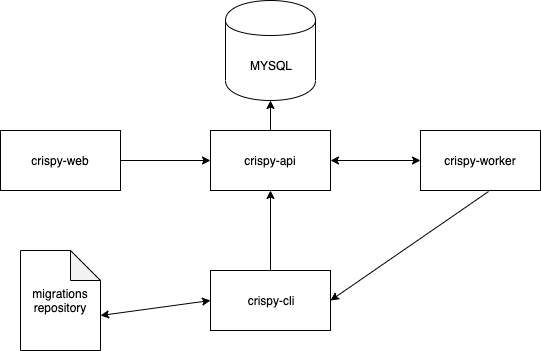

# crispy
Docs/Links/Infrastructure. Successor to database management tools

## Overview 

This is a tool to make developers life easier and database setup more reliable.

## Architecture

### Components

  - https://github.com/WiseEngineering/crispy-worker
  - https://github.com/WiseEngineering/crispy-web
  - https://github.com/WiseEngineering/crispy-api
  - https://github.com/WiseEngineering/crispy-cli

They must manage all database operations and be able to execute them in a particular worker. 
The main goal for those Components to be responsible for running database operations in `worker` and give the user the ability to manage it from [WEB](https://github.com/WiseEngineering/crispy-web) or by using [CLI](https://github.com/WiseEngineering/crispy-cli)

## How components will interact with each other

 

